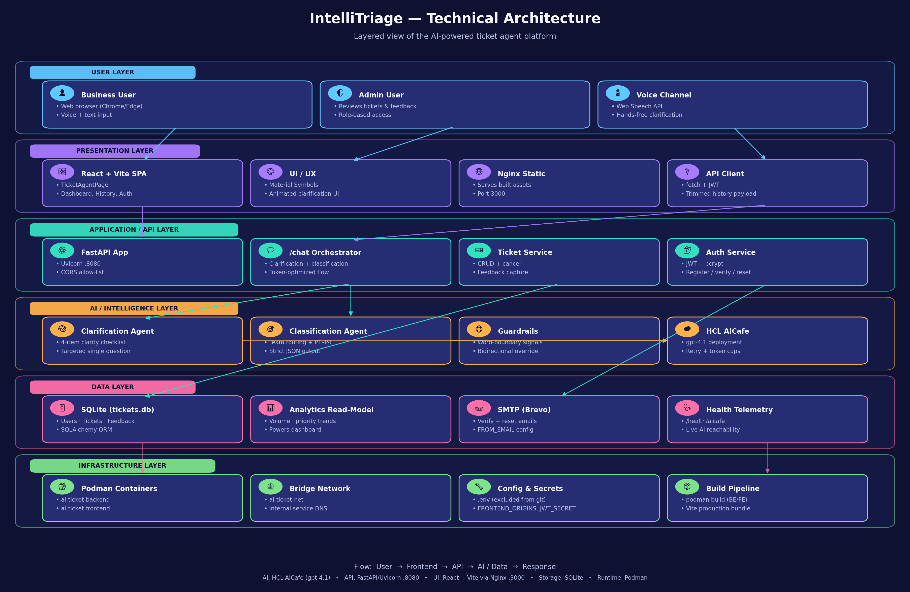

# AI Ticket Agent — IntelliTriage

IntelliTriage is a full-stack support ticketing application with AI-guided clarification, routing, and feedback capture. The product is branded as **IntelliTriage** in the UI, while the repository keeps the original `ai-ticket-agent` name.

## 🚦 Project Status

- 🟡 Current state: containerized and runnable locally with Podman
- 🤖 Runtime mode: AI-only routing through HCL AICafe
- 🧪 Data store: SQLite for local development and demo workflows
- 📦 Deliverables included: architecture diagrams in `docs/` and a branded deck in `AI-Ticket-Agent-Project-Deck.pptx`
- 🔒 Production hardening is still pending

## ✨ What The App Does

### 👤 User Flows

- ✅ Register and sign in
- 📧 Request password reset and email verification links
- 🤖 Submit ticket descriptions to the AI chat endpoint through text input
- 🎤 Submit ticket context through the voice-assisted flow
- ⌨️ Use **Ctrl+Enter** / **Cmd+Enter** in the ticket form for faster submission
- ❓ Receive a single targeted clarification question when the request is missing system, issue, impact, or urgency
- ⚡ Skip clarification automatically when the original request already contains enough context
- 📨 Create tickets with assigned team and priority once enough detail is available
- 🕘 Review ticket history and update ticket details
- 📝 Submit feedback on AI-assisted ticket outcomes

### 🛡️ Admin Flows

- 👀 View submitted feedback from users

## 🏗️ Current Architecture: AI-Only Routing

This project is currently configured for AI-only routing.

- 🤖 Clarification and classification are performed through HCL AICafe
- 🚫 Local fallback routing has been removed from active backend runtime code
- ⚠️ If AICafe is unavailable or the account is suspended, `POST /chat` returns `503`

### 🧠 Smart Clarity Validation

The `POST /chat` flow does not blindly trust the model. `backend/app/agents.py` extracts deterministic clarity signals from the user's message before deciding whether a clarification step is required.

- `has_system` — terms such as app, portal, vpn, email, database, sap, oracle
- `has_issue` — terms such as cannot, unable, error, down, slow
- `has_impact` — terms such as users, team, customer, business, affected
- `has_urgency` — terms such as urgent, asap, eod, critical, p1

A request is treated as clarity-complete when it contains **system + issue + (impact OR urgency)**.

- ✅ If the request is complete, the backend bypasses clarification even if the model suggested a question and proceeds directly to classification.
- 🔁 If a follow-up answer is provided, the original request and clarification answer are combined before classification.
- ❗ If the request is incomplete, or too short, the backend forces a clarification turn and can fall back to a deterministic question listing the missing fields.

This keeps ticket creation behavior stable even when model output varies.

## 🗂️ Project Structure

```text
ai-ticket-agent/
├─ README.md
├─ podman-compose.yml
├─ AI-Ticket-Agent-Project-Deck.pptx
├─ docs/
│  ├─ architecture-diagram.png
│  ├─ architecture-diagram.svg
│  ├─ echo-architecture-diagram.png
│  └─ echo-architecture-diagram.svg
├─ backend/
│  ├─ .env.example
│  ├─ Containerfile
│  ├─ pyproject.toml
│  ├─ requirements.txt
│  ├─ run.ps1
│  └─ app/
│     ├─ __init__.py
│     ├─ agents.py
│     ├─ auth.py
│     ├─ db.py
│     ├─ email_service.py
│     ├─ main.py
│     └─ models.py
└─ frontend/
   ├─ Containerfile
   ├─ package.json
   ├─ package-lock.json
   ├─ run.ps1
   └─ src/
      ├─ App.jsx
      ├─ App.css
      ├─ config.js
      ├─ main.jsx
      ├─ index.css
      ├─ context/
      │  └─ AuthContext.jsx
      └─ components/
         ├─ AdminFeedbackPage.jsx
         ├─ AnalyticalDashboard.jsx
         ├─ AuthPage.jsx
         ├─ ImageCarousel.jsx
         ├─ NavBar.jsx
         ├─ NeuralBackground.jsx
         ├─ SupportFooter.jsx
         ├─ TicketAgentPage.jsx
         ├─ TicketHistoryPanel.jsx
         ├─ UserGuide.jsx
         └─ VoiceAssistantModal.jsx
```

## 🖼️ Architecture Overview

### 📐 Technical Architecture Diagram



- PNG: `docs/architecture-diagram.png`
- SVG: [docs/architecture-diagram.svg](docs/architecture-diagram.svg)

### 🎨 Frontend

- React 18 + Vite single-page application
- `VITE_API_BASE_URL` controls the backend API base URL
- Main shell and orchestration live in `frontend/src/App.jsx`
- Authentication state is managed in `frontend/src/context/AuthContext.jsx`
- Brand surface is consistently **IntelliTriage** across hero, navigation, and footer

Main UI areas include:

- 🎫 AI Companion ticket submission page
- 🎤 Voice assistant modal and voice-wave interactions
- 📚 Ticket history panel
- 📊 Analytical dashboard with metrics and chart views
- 📘 User guide experience
- 🛡️ Admin feedback review page
- 🌌 Animated hero and background presentation layer

UI animations are centralized in `frontend/src/App.css`, including clarification, voice, routing, badge, and signal effects.

### ⚙️ Backend

- FastAPI application entrypoint in `backend/app/main.py`
- AI orchestration and prompt logic in `backend/app/agents.py`
- JWT authentication helpers in `backend/app/auth.py`
- SQLAlchemy models in `backend/app/models.py`
- Database configuration in `backend/app/db.py`
- SMTP email helpers in `backend/app/email_service.py`

### 🗄️ Database

- SQLite database file: `backend/tickets.db`
- Stores users, tickets, and feedback records
- Suitable for local development and demos, not for production-scale workloads

### 🐳 Containers

- Backend container serves FastAPI on port `8080`
- Frontend container serves the built app through Nginx on port `3000`
- `podman-compose.yml` wires both services together for packaged local execution

## 🔌 API Overview

| Area | Endpoint | Auth | Purpose |
| --- | --- | --- | --- |
| Health | `GET /health/aicafe` | No | Verifies upstream AICafe reachability |
| Chat | `POST /chat` | No | Submits a ticket request and returns either a clarification step or a created ticket result |
| Chat | `GET /chat` | No | Returns usage guidance for the chat endpoint |
| Tickets | `GET /tickets` | No | Lists tickets in reverse chronological order |
| Tickets | `HEAD /tickets` | No | Lightweight health-style check for ticket route availability |
| Tickets | `PUT /tickets/{ticket_number}` | No | Updates original message, clarified message, or assigned team |
| Tickets | `POST /tickets/{ticket_number}/cancel` | No | Marks a ticket as cancelled |
| Tickets | `POST /tickets/{ticket_number}/feedback` | Yes | Submits feedback for a ticket as the current authenticated user |
| Auth | `POST /auth/register` | No | Creates a user and sends email verification |
| Auth | `POST /auth/login` | No | Returns bearer token plus user profile |
| Auth | `POST /auth/forgot-password` | No | Sends password reset link if the account exists |
| Auth | `POST /auth/reset-password` | No | Resets password using a reset token |
| Auth | `GET /auth/verify` | No | Verifies email using the supplied token |
| Auth | `GET /auth/me` | Yes | Returns the current authenticated user |
| Admin | `GET /admin/feedbacks` | Admin | Returns all feedback entries for admin review |

## 🔐 Environment Variables

Copy `backend/.env.example` to `backend/.env` and provide real values.

### Required

```env
API_KEY=your-aicafe-api-key
JWT_SECRET=replace-with-long-random-secret
SMTP_HOST=smtp-relay.brevo.com
SMTP_PORT=2525
SMTP_USER=your-smtp-user
SMTP_PASS=your-smtp-password
FROM_EMAIL=you@example.com
APP_URL=http://localhost:3000
FRONTEND_ORIGINS=http://localhost:3000,http://127.0.0.1:3000
```

### Runtime configuration

```env
AICAFE_VERIFY_SSL=false
AICAFE_BASE_URL=https://aicafe.hcl.com
AICAFE_DEPLOYMENT_NAME=gpt-4.1
AICAFE_API_VERSION=2024-02-15-preview
ALLOW_LOCAL_FALLBACK=false
```

### Notes

- `API_KEY` must be valid and funded for AICafe requests to succeed
- `JWT_SECRET` should be long, random, and unique per environment
- `APP_URL` is used in password reset and verification links
- `FRONTEND_ORIGINS` must include every browser origin calling the backend
- `ALLOW_LOCAL_FALLBACK` should remain `false` for the current deployed behavior

## 🚀 Local Development Setup

### Prerequisites

- Python 3.10+
- Node.js 20+
- npm
- Podman for containerized local testing
- A valid HCL AICafe key with active quota

### 1. Backend setup

```powershell
cd backend
python -m pip install -r requirements.txt
python -m uvicorn app.main:app --reload --host 0.0.0.0 --port 8080
```

### 2. Frontend setup

```powershell
cd frontend
npm install
npm run dev
```

### Default local ports

- Frontend dev server: Vite default port such as `5173`
- Backend API: `8080`

## 🐳 Running With Podman

### Build images

```powershell
cd backend
podman build --tls-verify=false -t ai-ticket-backend -f Containerfile .

cd ..\frontend
podman build --tls-verify=false --build-arg VITE_API_BASE_URL=http://localhost:8080 -t ai-ticket-frontend -f Containerfile .
```

### Start containers manually

```powershell
cd ..
podman machine start
podman network create ai-ticket-net
podman run -d --name ai-ticket-backend --network ai-ticket-net -p 8080:8080 --env-file backend/.env localhost/ai-ticket-backend:latest
podman run -d --name ai-ticket-frontend --network ai-ticket-net -p 3000:80 localhost/ai-ticket-frontend:latest
```

### Or use compose

```powershell
podman compose up --build
```

### URLs

- Frontend: `http://localhost:3000`
- Backend: `http://localhost:8080`

### Important Podman note

Updating `backend/.env` does not update an already-running container. Recreate the backend container after any environment change.

## 💻 PowerShell Shortcuts

Available helper scripts:

- `backend/run.ps1`
- `frontend/run.ps1`

Use them for quick local startup without typing the full command sequence.

## 🧪 Validation Flow

Recommended manual verification flow:

1. Open `http://localhost:3000`
2. Register a user account
3. Trigger forgot-password flow
4. Log in with the created account
5. Submit a detailed ticket in AI Companion
6. Submit an incomplete ticket and confirm a clarification question appears
7. Submit a voice-assisted request and confirm transcript capture works
8. Verify the created ticket appears in Ticket History
9. Submit feedback for a ticket
10. Verify Admin Feedback view with an admin account

Expected ticket flow:

- Frontend sends `POST /chat`
- Backend determines whether clarification is required
- Backend classifies team and priority after enough detail is available
- Ticket is stored in SQLite
- Frontend renders ticket number, team, and priority

## 🩺 Connectivity Check

Use the backend health endpoint to verify AICafe connectivity:

```powershell
curl http://localhost:8080/health/aicafe
```

This is the quickest way to separate provider failures from frontend or local UI issues.

## 🛠️ Troubleshooting

### `405 Method Not Allowed` on `/tickets`

- The backend supports `HEAD /tickets`
- Hard-refresh the frontend if an older bundle is cached in the browser

### `503 Service Unavailable` on `/chat`

- The upstream AI provider rejected or could not process the request
- Check `GET /health/aicafe`

### AICafe quota / suspension error

If you see:

```json
{"detail":"AICafe access is suspended due to token limit. Please contact support to restore API access."}
```

then the app is reaching AICafe, but the provider account is blocked or quota-limited.

### CORS errors in the browser

Confirm `FRONTEND_ORIGINS` in `backend/.env` includes the exact frontend origin, for example:

```env
FRONTEND_ORIGINS=http://localhost:3000,http://127.0.0.1:3000
```

Then recreate the backend container.

### Reset / verify links point to the wrong host or port

- Update `APP_URL` in `backend/.env`
- Recreate the backend container

### Podman env changes are not taking effect

Recreate the backend container:

```powershell
podman rm -f ai-ticket-backend
podman run -d --name ai-ticket-backend --network ai-ticket-net -p 8080:8080 --env-file backend/.env localhost/ai-ticket-backend:latest
```

### Port conflicts

- If `3000` or `8080` is already in use, stop the conflicting process or remap ports in the Podman run command and compose file

### Browser voice input is not working

- Confirm microphone permission is granted in the browser
- Re-test in a Chromium-based browser if the current browser blocks speech APIs

## 🔒 Security Notes

- Do not commit `backend/.env`
- Do not paste passwords, API keys, or secrets into ticket text
- Use a strong random `JWT_SECRET`
- Rotate API keys if they were ever exposed in logs, screenshots, or commits
- For production, replace SQLite with a managed database and move secrets to a secret manager

## 🚧 Current Limitations

- SQLite is suitable for local and demo use, not for serious multi-user production workloads
- Email flows depend on valid SMTP credentials and relay availability
- AI routing depends entirely on upstream AICafe availability and quota status
- Container images are local-only today; there is no production registry or deployment pipeline yet

## 🗺️ Roadmap

- Move from SQLite to PostgreSQL for production readiness
- Add formal automated backend and frontend tests
- Add CI/CD build and deploy validation
- Add centralized logging, metrics, and alerting
- Harden admin access and production authentication flows

## 📘 Project Presentation Deck

A branded, animated PowerPoint deck is included at the repo root: `AI-Ticket-Agent-Project-Deck.pptx`.

The deck contains 11 slides covering the executive summary, architecture, AI flow, features, APIs, security, roadmap, and closeout material.
